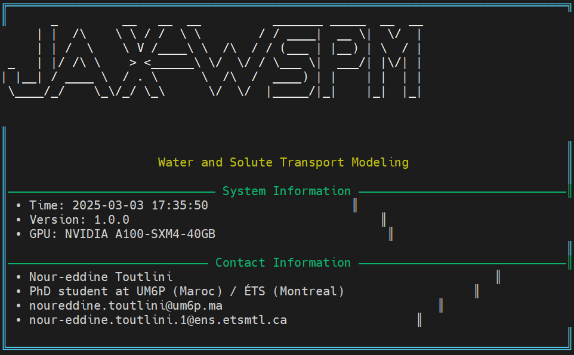
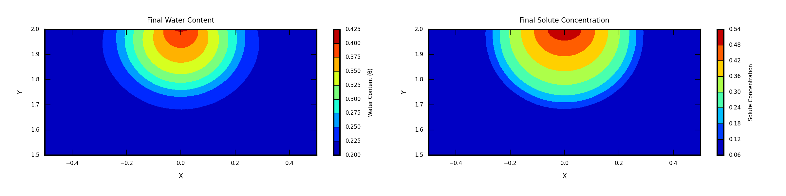

# JAX-WSPM


**JAX-WSPM** is a GPU-accelerated parallel framework using the JAX library for modeling water flow and solute transport in unsaturated porous media using an implicit finite element method. This repository provides an open-source implementation that leverages GPU acceleration, just-in-time (JIT) compilation, and automatic differentiation (AD) to solve the Richards equation and its associated transport equations efficiently.


## Paper Information

### Title
JAX-WSPM: A GPU-accelerated parallel framework using the JAX library for modeling water flow and solute transport in unsaturated porous media using an implicit finite element method

### Abstract
> Accurate simulation of water flow and solute transport in unsaturated porous media requires solving complex, nonlinear partial differential equations. Traditionally, implicit finite element methods have been used due to their robustness and stability. However, they are well known for their computational expense when addressing coupled dynamics. In this work, we present JAX-WSPM, a GPU-accelerated framework built with the JAX library that leverages GPU acceleration, just-in-time (JIT) compilation, and automatic differentiation (AD) to substantially accelerate computation, reduce simulation times, and improve scalability for the coupled water flow and solute transport systems in porous media. We use an implicit finite element method to solve the Richards equation, which models water flow in unsaturated media, and its associated transport equation. JAX-WSPM implements two complementary strategies for computing water fluxes that are critical for the solute transport equation: one based on conventional finite element formulations and another that supports automatic differentiation. In addition, an adaptive time-stepping strategy is employed to optimize performance.

Benchmark tests are conducted to examine the accuracy, efficiency, robustness, and scalability of JAX-WSPM in simulating both the Richards equation and the coupled flow-solute transport system. The results confirm the accuracy and efficiency of the code and show that JAX-WSPM can achieve speedups of up to 49× compared to serial implementations. JAX-WSPM is available at \url{https://github.com/nout0ut/JAX-WSPM}, providing a valuable tool for rapid prototyping and scalable, high-fidelity simulations in porous media.

## Authors and Contact

**Authors:**

- Nour-eddine Toutlini  
- Azzeddine Soulaïmani  
- Abdelaziz Beljadid  

**Contact Information:**

- Email: [noureddine.toutlini@um6p.ma](mailto:noureddine.toutlini@um6p.ma)
- Email: [nour-eddine.toutlini.1@ens.etsmtl.ca](mailto:nour-eddine.toutlini.1@ens.etsmtl.ca)


### Citation
```bibtex
@article{toutlini2025JAX_WSPM,
  title={JAX-WSPM: A GPU-accelerated parallel framework using the JAX library for modeling water flow and solute transport in unsaturated porous media using an implicit finite element method},
  author={Toutlini, N. and Soulaïmani, A. and Beljadid, A.},
  journal={Computer Physics Communications},
  note = {Under review},
  year={2025}
}
```
## Numerical Tests

This repository contains a comprehensive set of numerical tests that illustrate the accuracy, efficiency, and performance of the JAX-WSPM framework. In total, five test cases are provided:

- **Example 1:** Comprises three test cases (Test 1, Test 2, and Test 3) with available analytical solutions of the Richards equation, allowing direct validation of the code.
- **Example 2:** Presents a numerical test for the coupled flow–solute transport system, demonstrating the framework’s capability to handle multi-physics problems.
- **Example 3:** Applies JAX-WSPM to three-dimensional Richards equation simulation.

All simulations were conducted on Narval, a high-performance computing cluster provided by Compute Canada ([Narval Documentation](https://docs.alliancecan.ca/wiki/Narval)), using a single NVIDIA A100 GPU.

## Command-Line Interface

JAX-WSPM offers a streamlined command-line interface implemented in `src/cli.py`. For instance, to run a solute transport test case using the GMRES solver with no preconditioning on a mesh of size 1024, with an initial time step of `1e-4` and a maximum simulation time of `1`, use the following command:

```bash
python -m src.cli --test-case SoluteTest --solver gmres --preconditioner none --output-dir Soluteresults --mesh-size 1024 --dt 1e-4 --tmax 1
```

## Running Jobs with SLURM

For batch processing on high-performance computing clusters, you can use the provided SLURM job script (`job.sh`). Below is an example script for running Test 1, Test 2, and Test 3:

```bash
#!/bin/bash
#SBATCH --job-name=richards_benchmark
#SBATCH --output=logs/%j.out
#SBATCH --error=logs/%j.err
#SBATCH --time=2-00:00:00
#SBATCH --mem=40G
#SBATCH --cpus-per-task=1

module load cuda/12.6
module load python/3.12.4

mkdir -p logs results

echo "test_case,mesh_size,solver,preconditioner,simulation_time,iterations,l2_pressure,linf_pressure,l2_saturation,linf_saturation,l2_relative_pressure,l2_relative_saturation,memory_usage" > results/benchmark_results.csv

for test_case in Test1 Test2 Test3; do
   for mesh in 25 50 100; do
       for solver in direct cg bicgstab gmres; do
           for precond in none jacobi; do
               echo "Running: $test_case - mesh:$mesh - solver:$solver - precond:$precond"
               
               python -m src.cli \
                   --test-case $test_case \
                   --mesh-size $mesh \
                   --solver $solver \
                   --preconditioner $precond \
                   --output-dir results \
                   --tmax 0.25 \
                   --dt 1e-4
               
               TEST_CASE=$test_case MESH=$mesh SOLVER=$solver PRECOND=$precond python -c '
import os
file_name = f"results/numerical_results_{os.environ[\"TEST_CASE\"]}.npz"
import numpy as np
data = np.load(file_name)
print(f"{os.environ[\"TEST_CASE\"]},{os.environ[\"MESH\"]},{os.environ[\"SOLVER\"]},{os.environ[\"PRECOND\"]},"
     f"{data[\"simulation_time\"]:.4f},"
     f"{sum(data[\"iterations\"])},"
     f"{float(data[\"l2_pressure\"]):.4e},"
     f"{float(data[\"linf_pressure\"]):.4e},"
     f"{float(data[\"l2_saturation\"]):.4e},"
     f"{float(data[\"linf_saturation\"]):.4e},"
     f"{float(data[\"l2_relative_pressure\"]):.4e},"
     f"{float(data[\"l2_relative_saturation\"]):.4e},"
     f"{float(data[\"memory_usage\"]):.2f}")' >> results/benchmark_results_cpu_200.csv
           done
       done
   done
done
```
## Getting Started

**Clone the Repository:**
   ```bash
   git clone https://github.com/nout0ut/JAX-WSPM.git
   cd JAX-WSPM
   ```
## Install Dependencies

### For Local Environments 

It is recommended to create a virtual environment before installing the project dependencies. Run the following commands:

```bash
python -m venv venv
source venv/bin/activate   # On Windows: venv\Scripts\activate
pip install -r requirements.txt 
```
### For Alliance Canada Clusters (e.g., Narval, Graham, etc)

On these clusters, the necessary CUDA and Python environments are typically pre-configured. In that case, simply load the required modules:

```bash
module load cuda/12.6
module load python/3.12.4
```
## Water Content and Solute concentration Distributions (Example 2)



## Water Content Distribution Movie (Example 3)

[Watch the Water Content Distribution Movie](config/theta_movie.mp4)

